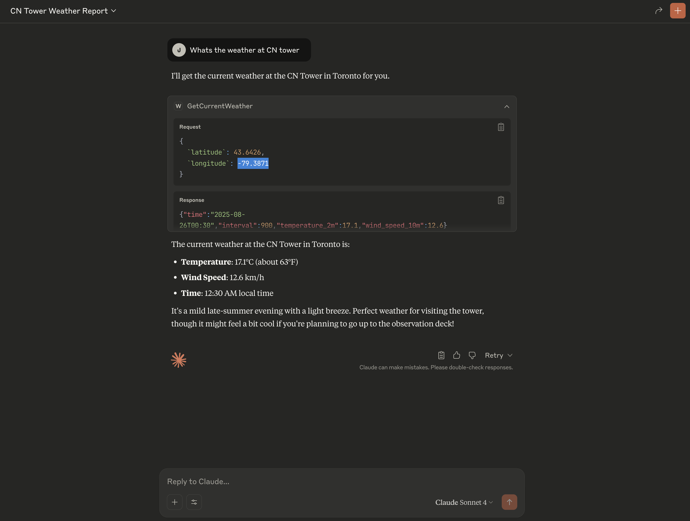

# Weather MCP Server

A Spring Boot-based Model Context Protocol (MCP) server that provides real-time weather data and forecasting tools for AI applications.

## Features

- **Current Weather**: Get real-time weather conditions for any location
- **Weather Forecast**: Retrieve hourly weather forecasts
- **MCP Integration**: Compatible with AI clients supporting Model Context Protocol

## Quick Start

### Prerequisites
- Java 21+
- Gradle

### Building the JAR

```bash
./gradlew build
```

### Running the Server

```bash
./gradlew bootRun
```

### MCP Client Configuration

To use this server with Claude Desktop or other MCP-compatible applications, add the following to your MCP configuration file:

```json
{
    "mcpServers": {
        "weather-mcp-server": {
            "command": "java",
            "args": [
                "-jar",
                "/path/to/WeatherMCPServer/build/libs/WeatherMCPServer-0.0.1-SNAPSHOT.jar"
            ]
        }
    }
}
```

**Configuration File Locations:**
- **Claude Desktop (macOS)**: `~/Library/Application Support/Claude/claude_desktop_config.json`
- **Claude Desktop (Windows)**: `%APPDATA%\Claude\claude_desktop_config.json`

After updating the configuration, restart your MCP client to load the weather tools.

## Available Tools

### Current Weather
Get current weather conditions including temperature, humidity, wind speed, and weather description.

**Parameters:**
- `latitude` (double): Geographic latitude
- `longitude` (double): Geographic longitude

### Weather Forecast
Retrieve hourly weather forecast data for the next 24-48 hours.

**Parameters:**
- `latitude` (double): Geographic latitude  
- `longitude` (double): Geographic longitude

## Data Source

Weather data is provided by [Open-Meteo API](https://open-meteo.com/), a free weather API service.

## Technology Stack

- **Spring Boot 3.5.5**
- **Spring AI MCP Server**
- **Java 21**
- **Gradle**

## Configuration

The server uses default configuration. Custom settings can be added to `application.properties`.

## Testing

The Weather MCP Server has been tested with real-world queries. Here's an example of getting weather information for Toronto's CN Tower:



## License

This project is open source and available under standard licensing terms.
